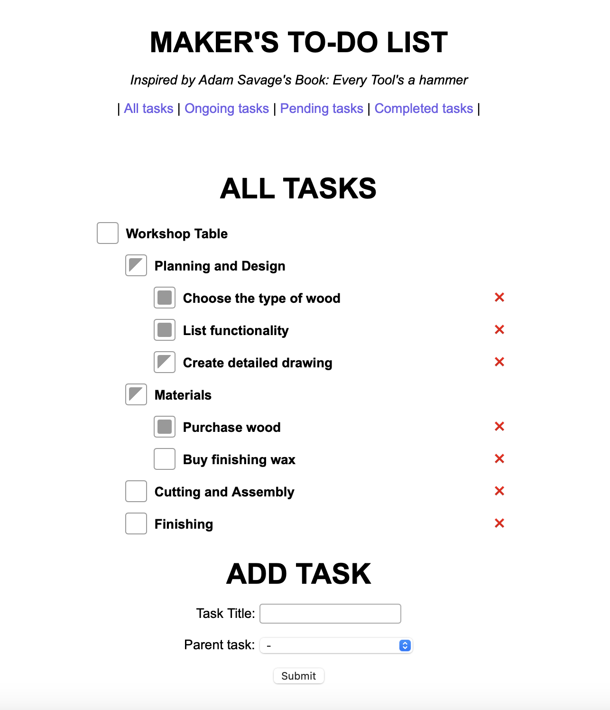

# Maker's To-do List

### A to-do list designed for makers by a maker.
Inspired by the three phase method for checklists (new, ongoing, complete) described in Adam Savages book 'Every Tool's a Hammer.' (credited to Brian Gernand from ILM.) 

This is a to-do list designed for flexible projects and workshop management. Supports sub tasks, filtering and other functions. Helps you organize your project and keep track of the incomplete and ongoing tasks.



### Disclaimer
This is an ongoing development, suggestions and input are welcomed. Try out the demo [here](https://harryhowiefish.pythonanywhere.com).

## Tools used

- Python 3.10.13
- Python packages - flask 3.0.1
- Database - sqlite
- Frontend / HTML - jinja templating, vanilla js

## Usage

Download git repo and navigate to the makers_todolist folder
```
cd ./makers_todolist
```

Install python requirements
```
pip install -r requirements.txt
```

Run the application
```
flask --app app/flask_app run
```

### Action list
- create a new branch to do session db


### Working progress
- QoL improvements
    - dark mode filter (priority)
    - auto update parent task status based on child tasks status.
    - rethink / design how lineage should be presented
- add user login and move to proper db service.
- additional/extended function
    - time based (maybe a separate table)
        - reoccurence task
        - weekly view
    - allow task detail and attachments
    - separate into three column view when a task tree is selected. (new, ongoing, complete)
    - export to csv and pdf for print out.


### Current issues
1. self parenting (i.e. id = parent_id) and recursive parenting (i.e. "id=1,parent_id=2","id=2,parent_id=1") are not check during insert and update in DB due to sqlite constraint. Both issues currently are only prevented from the frontend UI.

## Resources / Credit

1. [Wired: Adam Savage on Lists, More Lists, and the Power of Checkboxes](https://www.wired.com/story/adam-savage-lists-more-lists-power-checkboxes/)
2. [Checkbox style adapted from neontomo](https://github.com/neontomo/neontomo.github.io/tree/main/play/checkbox)